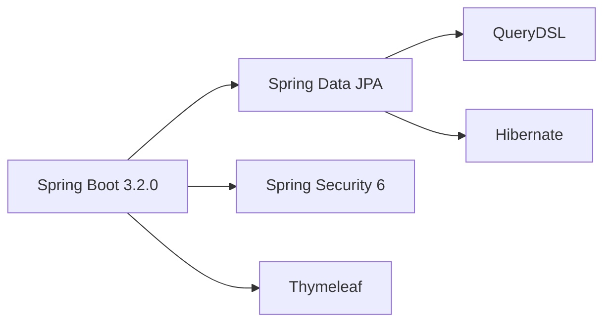
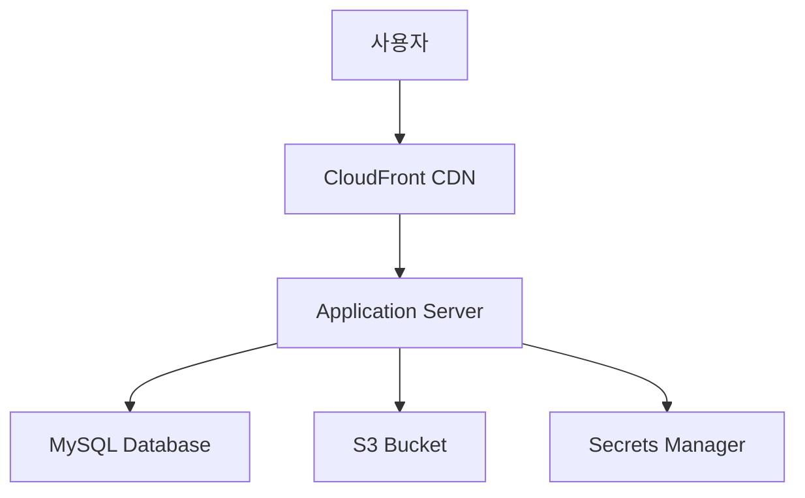
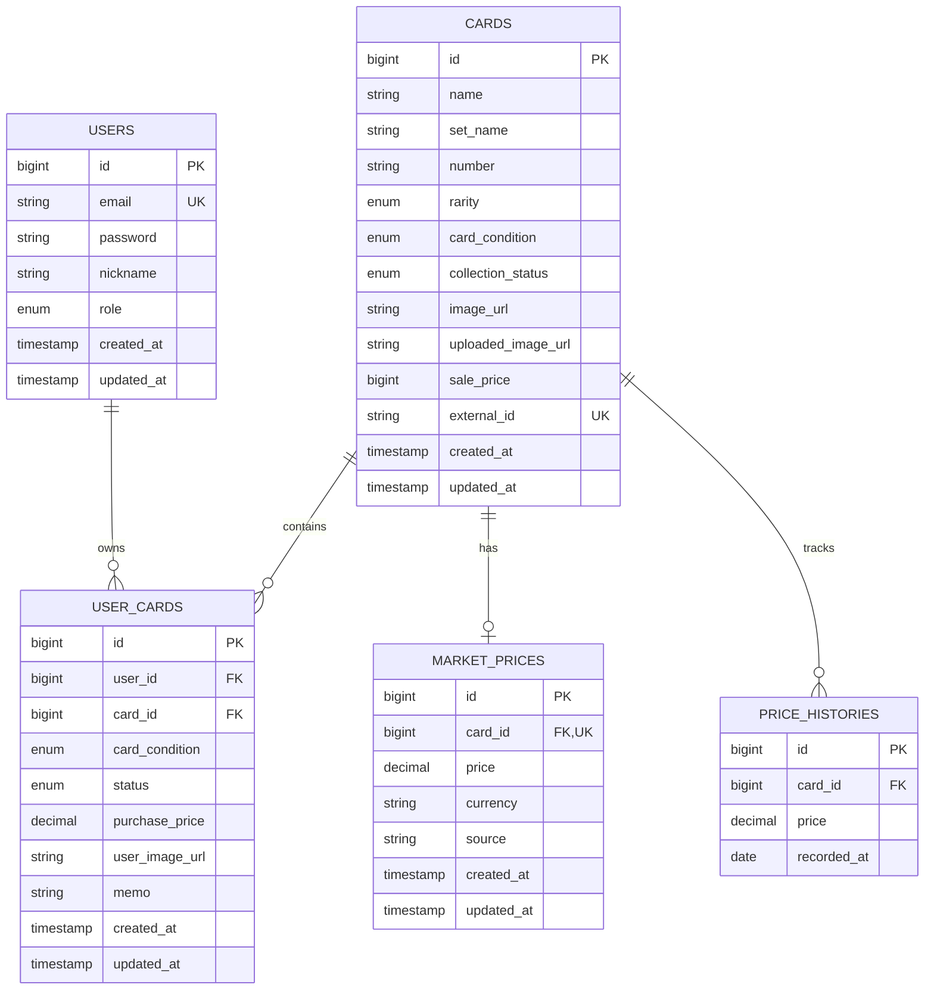

# 🃏 PokeKernel

<div align="center">


**포켓몬 카드 컬렉션 관리 시스템**

개인 포켓몬 카드 컬렉션을 체계적으로 관리하고,  
시세를 추적하며, 투자 수익률을 분석할 수 있는 웹 애플리케이션

[기능 소개](#-주요-기능) •
[빠른 시작](#-빠른-시작) •
[스크린샷](#-스크린샷) •
[기술 스택](#-기술-스택)

</div>

---

## 📖 소개

PokeKernel은 포켓몬 카드 수집가를 위한 개인 컬렉션 관리 도구입니다.  
카드 정보 등록, 이미지 업로드, 시세 추적, 수익률 분석 등의 기능을 통해  
체계적인 컬렉션 관리를 지원합니다.

### 💡 이런 분들에게 추천합니다
- 📦 포켓몬 카드를 체계적으로 관리하고 싶은 수집가
- 📈 카드 시세 변동을 추적하고 수익률을 분석하고 싶은 투자자
- 🎯 보유 카드와 위시리스트를 한 곳에서 관리하고 싶은 분
- 🖼️ 카드 상태를 사진으로 기록하고 싶은 분

---

## ✨ 주요 기능

### 1️⃣ 카드 등록 및 관리

<table>
<tr>
<td width="50%">

**🎴 간편한 카드 등록**
- 카드 이름, 번호, 세트 정보 입력
- 희귀도 선택 (Common ~ Secret Rare)
- 카드 이미지 직접 업로드
- 판매 희망가 설정 (원화)

</td>
<td width="50%">

**✏️ 상세 정보 관리**
- 카드 상태 7단계 분류
  - MINT (미개봉/신품)
  - NEAR_MINT (S급)
  - EXCELLENT (A급)
  - LIGHTLY_PLAYED (B급)
  - PLAYED (C급)
  - HEAVILY_PLAYED (D급)
  - DAMAGED (파손)

</td>
</tr>
<tr>
<td width="50%">

**📊 컬렉션 상태 추적**
- OWNED (보유중)
- WISHLIST (위시리스트)
- FOR_TRADE (교환중)
- FOR_SALE (판매중)
- TRADED (교환 완료)
- SOLD (판매 완료)

</td>
<td width="50%">

**🖼️ 이미지 관리**
- 로컬 이미지 업로드
- AWS S3 클라우드 저장 (운영)
- CloudFront CDN 연동
- 자동 이미지 최적화

</td>
</tr>
</table>

### 2️⃣ 시세 추적 및 분석

| 기능 | 설명 |
|------|------|
| **💰 시세 기록** | 카드별 현재 시세를 USD로 직접 입력 |
| **📈 가격 그래프** | Chart.js 기반 시세 변동 그래프 시각화 |
| **💱 환율 변환** | EUR ↔ USD 자동 환율 적용 |
| **📅 히스토리 관리** | 날짜별 시세 변동 이력 저장 |

### 3️⃣ 수익률 분석 대시보드

```
┌─────────────────────────────────────────────┐
│  📊 컬렉션 요약                             │
├─────────────────────────────────────────────┤
│  총 구매액      │  € 1,250.00              │
│  현재 평가액    │  € 1,650.00              │
│  수익금         │  + € 400.00              │
│  수익률         │  + 32.00%                │
└─────────────────────────────────────────────┘
```

- ✅ 개별 카드별 수익률 계산
- ✅ 전체 컬렉션 수익률 요약
- ✅ 실시간 손익 현황 표시
- ✅ 구매 메모 및 출처 기록

### 4️⃣ 보안 및 관리

| 구분 | 개발 환경 | 운영 환경 |
|------|----------|----------|
| 데이터베이스 | H2 (인메모리) | MySQL |
| 이미지 저장 | 로컬 파일시스템 | AWS S3 + CloudFront |
| 보안 | H2 Console 허용 | 강화된 보안 설정 |
| CSRF | 비활성화 | 활성화 |
| 설정 관리 | application-dev.yml | AWS Secrets Manager |

---

## 🚀 빠른 시작

### 1단계: 요구사항 확인

```bash
java -version    # Java 17 이상
./gradlew -v     # Gradle 8.5
```

### 2단계: 프로젝트 클론

```bash
git clone https://github.com/devKobe24/pokekernel.git
cd pokekernel
```

### 3단계: 개발 환경 설정 파일 생성

`src/main/resources/application-dev.yml` 파일을 생성하고 다음 내용을 입력하세요:

```yaml
spring:
  datasource:
    url: jdbc:h2:mem:pokemon_db
    username: sa
    password:
    driver-class-name: org.h2.Driver

  h2:
    console:
      enabled: true
      path: /h2-console

  jpa:
    hibernate:
      ddl-auto: create
    show-sql: true
    properties:
      hibernate:
        format_sql: true

# 관리자 계정 설정
admin:
  email: admin@pokekernel.com
  password: admin1234
  nickname: pokemon_master

# 이미지 업로드 설정
app:
  upload:
    dir: uploads/images
    url-prefix: /uploads/images
```

### 4단계: 애플리케이션 실행

```bash
# Gradle로 실행
./gradlew bootRun --args='--spring.profiles.active=dev'

# 또는 JAR 빌드 후 실행
./gradlew build
java -jar build/libs/pokekernel-app-0.1.2.jar --spring.profiles.active=dev
```

### 5단계: 접속 확인

| 페이지 | URL | 설명 |
|--------|-----|------|
| 메인 페이지 | http://localhost:8080 | 랜딩 페이지 |
| 카드 목록 | http://localhost:8080/cards | 전체 카드 목록 |
| 관리자 로그인 | http://localhost:8080/admin/login | 관리자 페이지 |
| 카드 등록 | http://localhost:8080/admin/cards/register | 새 카드 등록 |
| H2 Console | http://localhost:8080/h2-console | 데이터베이스 확인 |

**기본 관리자 계정:**
- 이메일: `admin@pokekernel.com`
- 비밀번호: `admin1234`

---

## 📸 스크린샷

### 메인 페이지
```
┌──────────────────────────────────────────┐
│                                          │
│         🃏 POKÉMON                       │
│      Premium Collection                  │
│                                          │
│  ┌────────┐  ┌────────┐  ┌────────┐    │
│  │  희귀  │  │ 홀로   │  │ 1판   │    │
│  │  카드  │  │ 그래픽 │  │ 에디션│    │
│  └────────┘  └────────┘  └────────┘    │
│                                          │
│        [ 컬렉션 보기 ]                   │
│                                          │
└──────────────────────────────────────────┘
```

### 카드 목록 페이지
```
My Pokémon Collection                Total Cards: 15

┌─────────┐  ┌─────────┐  ┌─────────┐  ┌─────────┐
│ Pikachu │  │Charizard│  │ Mewtwo  │  │ Eevee   │
│   [IMG] │  │  [IMG]  │  │  [IMG]  │  │  [IMG]  │
│   151   │  │ 초전브레이│  │   151   │  │   151   │
│  HOLO   │  │   UR    │  │   AR    │  │  RARE   │
│ $ 25.99 │  │ $ 89.99 │  │ $ 45.50 │  │ $ 12.30 │
│         │  │         │  │         │  │         │
│ MINT    │  │NEAR_MINT│  │EXCELLENT│  │  MINT   │
│ 보유중   │  │  판매중  │  │  보유중  │  │ 보유중  │
└─────────┘  └─────────┘  └─────────┘  └─────────┘
```

### 카드 상세 페이지
```
┌────────────────────────────────────────────────┐
│  [← Back to List]                              │
│                                                │
│  ┌──────────┐  Pikachu                        │
│  │          │  151 | HOLO_RARE                │
│  │  [IMAGE] │                                  │
│  │          │  카드 상태: MINT (미개봉/신품)    │
│  │          │  컬렉션 상태: OWNED (보유중)      │
│  └──────────┘                                  │
│               $ 25.99                          │
│                                                │
│               희망 판매 가격                    │
│               ₩ 50,000                         │
│                                                │
│               [ + Instagram ]                  │
│                                                │
│  ┌─ Price History ─────────────────┐         │
│  │     30 ┤              ╱          │         │
│  │     25 ┤         ╱───╱           │         │
│  │     20 ┤    ╱───╱                │         │
│  │     15 ┤───╱                     │         │
│  │        └────────────────────────  │         │
│  │         Jan  Feb  Mar  Apr       │         │
│  └───────────────────────────────────┘         │
└────────────────────────────────────────────────┘
```

---

## 🏗️ 기술 스택

### Backend


| 기술 | 버전 | 용도 |
|------|------|------|
| Java | 17 | 언어 |
| Spring Boot | 3.2.0 | 프레임워크 |
| Spring Data JPA | - | ORM |
| QueryDSL | 5.0.0 | 타입 안전 쿼리 |
| Spring Security | 6 | 인증/인가 |
| Thymeleaf | - | 템플릿 엔진 |
| Lombok | - | 보일러플레이트 제거 |

### Database
| 환경 | DB | 용도 |
|------|-----|------|
| 개발 | H2 | 인메모리 개발 DB |
| 운영 | MySQL | 프로덕션 DB |

### Frontend
```
HTML5 + CSS3 + JavaScript (ES6+)
├── Thymeleaf (서버사이드 렌더링)
├── Chart.js (시세 그래프)
├── TypeScript (빌드 자동화)
└── Node.js (프론트엔드 빌드)
```

### Infrastructure (운영 환경)



| 서비스 | 용도 |
|--------|------|
| AWS S3 | 이미지 저장 |
| AWS CloudFront | CDN |
| AWS Secrets Manager | 환경 변수 관리 |
| GitHub Actions | CI/CD |

---

## 📁 프로젝트 구조

```
pokekernel/
├── src/
│   ├── main/
│   │   ├── java/com/kobe/pokekernle/
│   │   │   ├── domain/
│   │   │   │   ├── admin/           # 관리자 기능
│   │   │   │   │   ├── controller/  # 카드 CRUD 컨트롤러
│   │   │   │   │   └── service/     # 이미지 업로드 서비스
│   │   │   │   ├── card/            # 카드 도메인
│   │   │   │   │   ├── entity/      # Card, MarketPrice, PriceHistory
│   │   │   │   │   ├── repository/  # JPA Repository
│   │   │   │   │   ├── service/     # 비즈니스 로직
│   │   │   │   │   └── dto/         # DTO
│   │   │   │   ├── collection/      # 컬렉션 도메인
│   │   │   │   │   ├── entity/      # UserCard, 상태 Enum
│   │   │   │   │   ├── repository/
│   │   │   │   │   └── service/     # 수익률 계산
│   │   │   │   └── user/            # 사용자 도메인
│   │   │   │       ├── entity/      # User, Role
│   │   │   │       └── repository/
│   │   │   ├── global/
│   │   │   │   ├── config/
│   │   │   │   │   └── security/    # 프로필별 보안 설정
│   │   │   │   └── entity/          # BaseTimeEntity
│   │   │   └── controller/          # 뷰 컨트롤러
│   │   └── resources/
│   │       ├── static/
│   │       │   ├── css/             # 스타일시트
│   │       │   ├── js/              # JavaScript
│   │       │   └── images/          # 이미지 리소스
│   │       └── templates/           # Thymeleaf 템플릿
│   │           ├── admin/           # 관리자 페이지
│   │           ├── cards/           # 카드 목록/상세
│   │           └── collection/      # 컬렉션 페이지
│   └── test/                        # 테스트 코드
├── uploads/                         # 로컬 이미지 저장 (개발)
├── build.gradle                     # 빌드 설정
└── README.md
```

---

## ⚙️ 환경별 설정

### 개발 환경 (dev)

**활성화:**
```bash
./gradlew bootRun --args='--spring.profiles.active=dev'
```

**특징:**
- ✅ H2 인메모리 데이터베이스
- ✅ 로컬 파일시스템 이미지 저장
- ✅ H2 Console 활성화
- ✅ CSRF 비활성화 (편의성)
- ✅ SQL 로깅 활성화

### 운영 환경 (prod)

**활성화:**
```bash
java -jar app.jar --spring.profiles.active=prod
```

**필수 설정:**
```yaml
# AWS Secrets Manager에 저장
{
  "admin.email": "admin@example.com",
  "admin.password": "secure_password",
  "spring.datasource.url": "jdbc:mysql://host:3306/pokekernel",
  "spring.datasource.username": "db_user",
  "spring.datasource.password": "db_password",
  "spring.cloud.aws.s3.bucket": "your-bucket-name",
  "spring.cloud.aws.region.static": "ap-northeast-2"
}
```

**특징:**
- ✅ MySQL 데이터베이스
- ✅ AWS S3 이미지 저장
- ✅ CloudFront CDN
- ✅ CSRF 활성화
- ✅ 강화된 보안 설정

---

## 🎯 사용 가이드

### 1. 카드 등록하기

1. 관리자 로그인 (`/admin/login`)
2. "카드 등록" 메뉴 클릭
3. 카드 정보 입력:
  - 포켓몬 이름
  - 카드 번호
  - 세트 이름
  - 희귀도 선택
  - 카드 상태 선택 (MINT, NEAR_MINT 등)
  - 컬렉션 상태 선택 (OWNED, FOR_SALE 등)
4. 이미지 업로드 (선택사항)
5. 판매 희망가 입력 (원화)
6. 현재 시세 입력 (USD, 선택사항)
7. "카드 검색 및 등록" 클릭

### 2. 시세 추적하기

**카드 상세 페이지에서:**
1. 카드 클릭하여 상세 페이지 이동
2. 시세 그래프 확인
3. 수정 버튼 클릭
4. "현재 시세 (USD)" 입력
5. 저장하면 자동으로 히스토리에 기록

**그래프 확인:**
- X축: 날짜
- Y축: 가격 (USD)
- 차트는 자동으로 업데이트

### 3. 컬렉션 수익률 확인하기

1. "My Collection" 메뉴 클릭 (`/collection`)
2. 대시보드에서 전체 요약 확인:
  - 총 구매액
  - 현재 평가액
  - 총 수익금
  - 수익률 (%)
3. 개별 카드별 수익률 확인
4. 카드 클릭하여 상세 정보 확인

### 4. 카드 상태 관리

**카드 상태 (CardCondition):**
- `MINT`: 미개봉/신품
- `NEAR_MINT`: S급 (거의 새것)
- `EXCELLENT`: A급 (약간의 사용감)
- `LIGHTLY_PLAYED`: B급 (눈에 띄는 상처)
- `PLAYED`: C급 (플레이용)
- `HEAVILY_PLAYED`: D급 (심한 사용 흔적)
- `DAMAGED`: 파손됨

**컬렉션 상태 (CollectionStatus):**
- `OWNED`: 보유중
- `WISHLIST`: 위시리스트 (갖고싶음)
- `FOR_TRADE`: 교환중
- `FOR_SALE`: 판매중
- `TRADED`: 교환 완료
- `SOLD`: 판매 완료

---

## 🔧 개발자 가이드

### 빌드 및 테스트

```bash
# 전체 빌드
./gradlew build

# 테스트 제외 빌드
./gradlew build -x test

# 테스트만 실행
./gradlew test

# 특정 테스트 실행
./gradlew test --tests CardServiceTest

# 애플리케이션 실행
./gradlew bootRun

# JAR 생성
./gradlew bootJar
# 결과: build/libs/pokekernel-app-0.1.2.jar
```

### Git 커밋 컨벤션

```
타입: 제목

본문 (선택사항)

푸터 (선택사항)
```

**타입:**
- `feat`: 새로운 기능 추가
- `fix`: 버그 수정
- `docs`: 문서 수정
- `style`: 코드 포맷팅
- `refactor`: 리팩토링
- `test`: 테스트 추가/수정
- `chore`: 빌드 설정, 패키지 업데이트

**예시:**
```
feat: 카드 상태별 필터링 기능 추가

- CardCondition enum에 description 필드 추가
- 카드 목록 페이지에 필터 드롭다운 구현
- QueryDSL 동적 쿼리로 필터링 로직 작성

Resolves: #123
```

### 로컬 개발 환경 설정

```bash
# 1. 저장소 클론
git clone https://github.com/devKobe24/pokekernel.git
cd pokekernel

# 2. 설정 파일 복사
cp src/main/resources/application.yml.example \
   src/main/resources/application-dev.yml

# 3. 의존성 다운로드
./gradlew dependencies

# 4. 애플리케이션 실행
./gradlew bootRun --args='--spring.profiles.active=dev'
```

---

## 🐛 트러블슈팅

### 문제 1: H2 Console 접속 안됨

**증상:**
```
403 Forbidden 오류
```

**해결:**
```yaml
# application-dev.yml 확인
spring:
  h2:
    console:
      enabled: true  # 반드시 true

# profile이 dev인지 확인
--spring.profiles.active=dev
```

### 문제 2: 이미지 업로드 실패

**증상:**
```
FileNotFoundException: uploads/images
```

**해결:**
```bash
# 디렉토리 생성
mkdir -p uploads/images

# 권한 확인 (Mac/Linux)
chmod 755 uploads/images

# Windows: 폴더 속성에서 쓰기 권한 확인
```

### 문제 3: 관리자 계정 로그인 안됨

**증상:**
```
사용자를 찾을 수 없습니다
```

**해결:**
```bash
# 로그 확인
[ADMIN INIT] 관리자 계정이 생성되었습니다

# 없으면 application-dev.yml 확인
admin:
  email: admin@pokekernel.com
  password: admin1234
  
# 애플리케이션 재시작
```

### 문제 4: Gradle 빌드 실패

**증상:**
```
Node.js not found
```

**해결:**
```bash
# Node.js 자동 다운로드 설정 확인
# build.gradle의 node 섹션 확인

node {
    version = '18.16.0'
    download = true  # 자동 다운로드
}

# 수동 설치도 가능
# https://nodejs.org 에서 다운로드
```

---

## 📊 데이터베이스 스키마

### ERD



### 주요 테이블 설명

| 테이블 | 설명 | 주요 컬럼 |
|--------|------|-----------|
| `users` | 사용자 정보 | email, password, role |
| `cards` | 카드 마스터 정보 | name, set_name, rarity, sale_price |
| `user_cards` | 개인 컬렉션 | purchase_price, condition, memo |
| `market_prices` | 현재 시세 | price, currency (1:1 with cards) |
| `price_histories` | 시세 히스토리 | price, recorded_at |

---

## 🚀 배포 가이드

### Docker로 배포

**1. Dockerfile 생성:**
```dockerfile
FROM openjdk:17-jdk-slim
WORKDIR /app
COPY build/libs/pokekernel-app-0.1.2.jar app.jar
EXPOSE 8080
ENTRYPOINT ["java", "-jar", "app.jar"]
```

**2. 이미지 빌드:**
```bash
./gradlew bootJar
docker build -t pokekernel:latest .
```

**3. 컨테이너 실행:**
```bash
docker run -d \
  -p 8080:8080 \
  -e SPRING_PROFILES_ACTIVE=prod \
  --name pokekernel \
  pokekernel:latest
```

### AWS EC2 배포

**1. EC2 인스턴스 생성**
- AMI: Ubuntu 22.04 LTS
- 인스턴스 타입: t2.micro 이상
- 보안 그룹: 8080 포트 개방

**2. 애플리케이션 배포:**
```bash
# EC2 접속
ssh -i key.pem ubuntu@your-ec2-ip

# Java 17 설치
sudo apt update
sudo apt install openjdk-17-jdk -y

# 애플리케이션 업로드
scp -i key.pem build/libs/pokekernel-app-0.1.2.jar \
    ubuntu@your-ec2-ip:~/

# 실행
nohup java -jar pokekernel-app-0.1.2.jar \
    --spring.profiles.active=prod &
```

### GitHub Actions CI/CD

`.github/workflows/deploy.yml`:
```yaml
name: Deploy to Production

on:
  push:
    branches: [ main ]

jobs:
  build:
    runs-on: ubuntu-latest
    
    steps:
    - uses: actions/checkout@v3
    
    - name: Set up JDK 17
      uses: actions/setup-java@v3
      with:
        java-version: '17'
        distribution: 'temurin'
    
    - name: Grant execute permission for gradlew
      run: chmod +x gradlew
    
    - name: Build with Gradle
      run: ./gradlew build -x test
    
    - name: Deploy to EC2
      env:
        PRIVATE_KEY: ${{ secrets.EC2_SSH_KEY }}
        HOST: ${{ secrets.EC2_HOST }}
        USER: ubuntu
      run: |
        echo "$PRIVATE_KEY" > private_key.pem
        chmod 600 private_key.pem
        scp -i private_key.pem -o StrictHostKeyChecking=no \
            build/libs/*.jar ${USER}@${HOST}:~/
        ssh -i private_key.pem -o StrictHostKeyChecking=no \
            ${USER}@${HOST} 'sudo systemctl restart pokekernel'
```

---

## 🤝 기여하기

PokeKernel 프로젝트에 기여해주셔서 감사합니다!

### 기여 프로세스

1. **Fork** 버튼을 클릭하여 저장소를 포크합니다
2. **Feature 브랜치** 생성: `git checkout -b feature/amazing-feature`
3. **변경사항 커밋**: `git commit -m 'feat: Add amazing feature'`
4. **브랜치 푸시**: `git push origin feature/amazing-feature`
5. **Pull Request** 생성

### 코드 스타일

- Java: Google Java Style Guide
- 들여쓰기: 4 spaces
- 줄 길이: 120자 이내
- JavaDoc 주석 권장

---

## 📝 라이선스

이 프로젝트는 MIT 라이선스 하에 배포됩니다.  
자세한 내용은 [LICENSE](LICENSE) 파일을 참고하세요.

```
MIT License

Copyright (c) 2024 Kobe

Permission is hereby granted, free of charge, to any person obtaining a copy
of this software and associated documentation files (the "Software"), to deal
in the Software without restriction...
```

---

## 👨‍💻 만든 사람

<div align="center">

**Kobe**

[](https://github.com/devKobe24)
[](mailto:your-email@example.com)

*Made with ❤️ for Pokémon Card Collectors*

</div>

---

## 🙏 감사의 글

이 프로젝트는 다음 오픈소스 기술들을 사용하여 만들어졌습니다:

- [Spring Boot](https://spring.io/projects/spring-boot) - 강력한 Java 프레임워크
- [Chart.js](https://www.chartjs.org) - 아름다운 차트 라이브러리
- [Thymeleaf](https://www.thymeleaf.org) - 서버사이드 템플릿 엔진
- [AWS](https://aws.amazon.com) - 클라우드 인프라

---

## 📮 문의 및 지원

- 📧 이메일: your-email@example.com
- 🐛 버그 리포트: [GitHub Issues](https://github.com/devKobe24/pokekernel/issues)
- 💬 기능 제안: [GitHub Discussions](https://github.com/devKobe24/pokekernel/discussions)

---

<div align="center">

**⭐ 이 프로젝트가 유용하다면 Star를 눌러주세요! ⭐**

[⬆ 맨 위로 가기](#-pokekernel)

</div>
